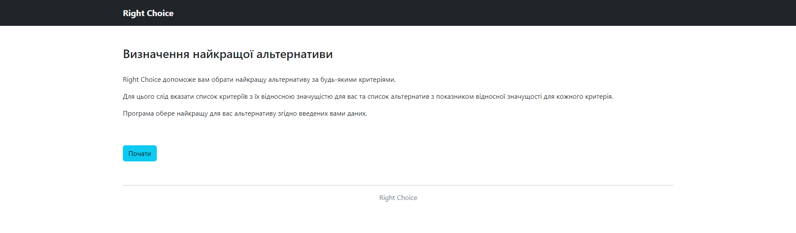
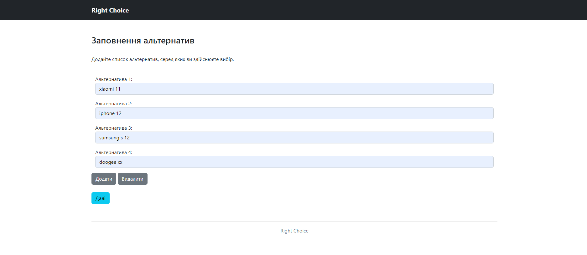
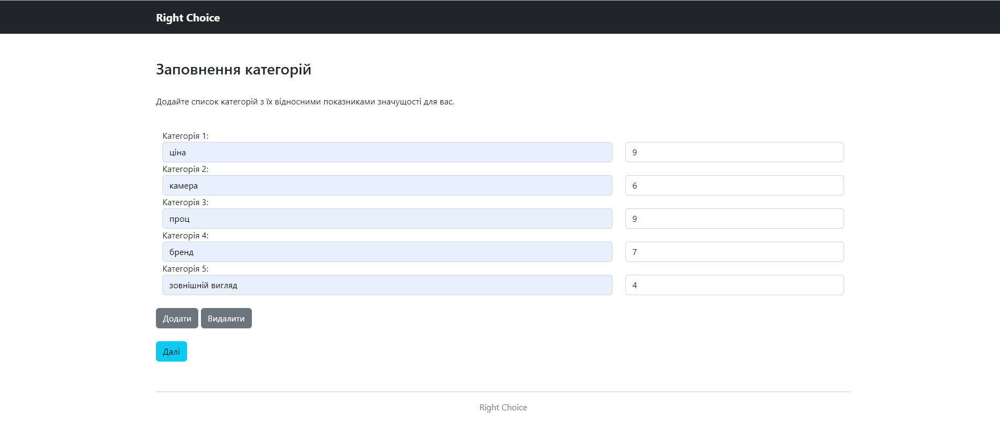
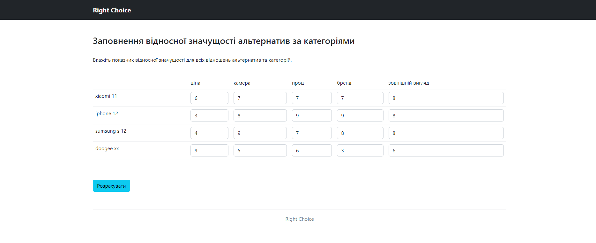
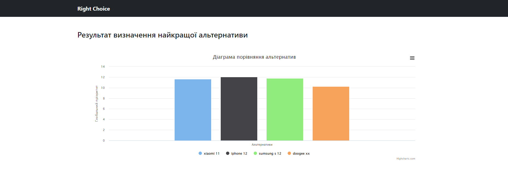
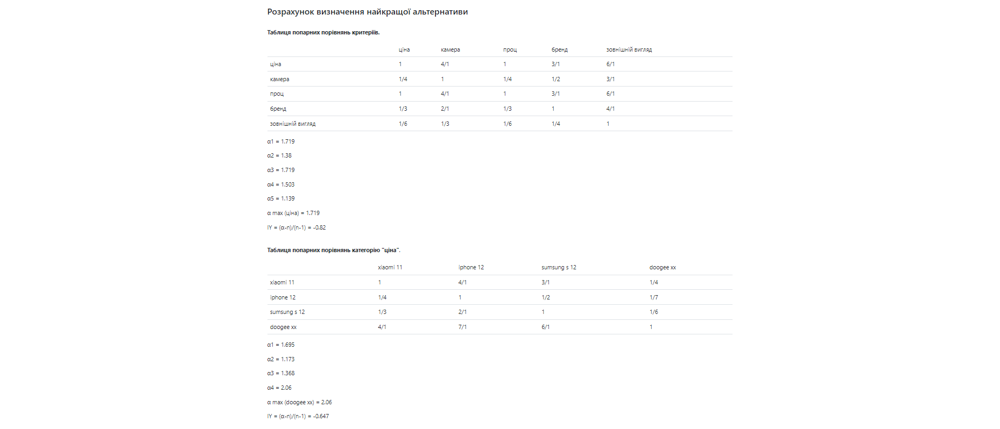
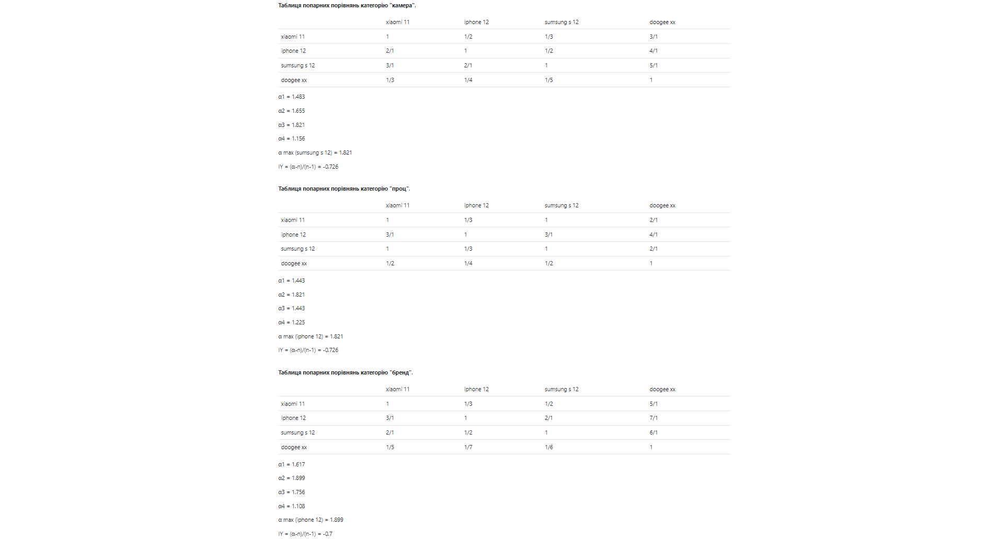

# Project name
Right Choice

# General info
A web application for determining the best alternative under conditions of uncertainty.

# Technologies
* python 3
* flask 2.2.0
* bootstrap 5.2
* highcharts
* pytest
* html
* css
* jquery

# Setup
To run the project install libraries specified in requirements.txt

# Status
Project is: in progress
